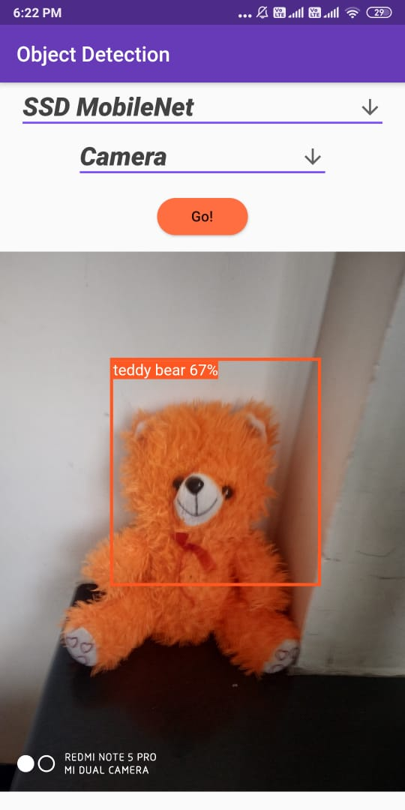

# Object_Detection_Master

A new Flutter project that uses tflite package to detect objects. It uses SSDMobileNet and YOLOv2 models to perform detections.
Inputs can be given using file system, Camera and Live camera feed.

An example of its working is given below. 

Download the zip.
Run the following command.

"flutter run"

And get set detect!!
